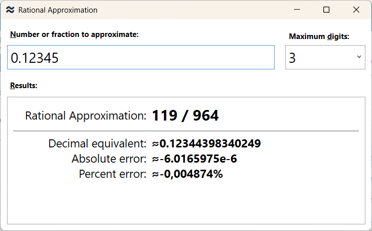

# Rational Approximation

An experimental tool to find the rational approximation of decimal numbers and fractions, 
giving a maximum size (in digits) of nominator and denominator.

#### Examples of calculations

(_Let us limit the nominator and denominator to three digits_).

Input         | Rational Approximation
:---          | :--- 
0.12345		  | 119 / 964
1234 / 5678	  |	153 / 704

The program support repeating (recurring) decimals using the “(&#xA0;)” notation, 
as well as exponents:

Input         | Rational Approximation
:---          | :--- 
0.(3)         | 1 / 3
0.12(345)     | 10 / 81
0.8(9)        | 9 / 10
1.234e-4      | 617 / 5

If the input number is too close to zero or too large, and the maximum number of digits is insufficient, 
then the result may include an exponent, for example:

Input         | Rational Approximation
:---          | :--- 
1.2345e-7     |	458e-7 / 371 
1234567/89	  |	799e+4 / 576

The program also accepts the name of some common constants: 

Input         | Rational Approximation
:---          | :--- 
pi            |	355 / 113
e             |	878 / 323

#### A view of the program

### Usage

The program runs in this environment:

* Windows 11 or Windows 10 (64-bit),
* .NET 9.

Download and unzip the latest archive from the **Releases** section. Launch the **RationalApproximation** executable.

Alternatively, the source files, which are got from the **Releases** section too, can be compiled in Visual Studio 2022
that includes the “.NET desktop development” workload. The program is made in C#, WPF.

 

### References

* \[1\] Farey sequence — https://en.wikipedia.org/wiki/Farey_sequence
* \[2\] Rational approximation to a decimal number — https://www.johndcook.com/rational_approximation.html

 
 

