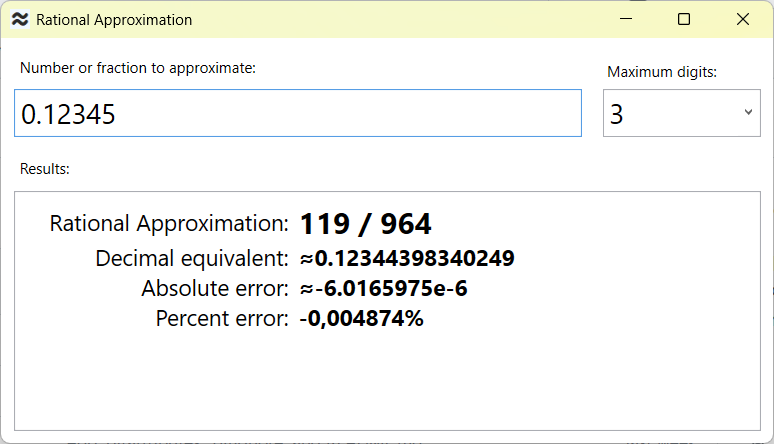

# Rational Approximation

A tool to find the rational approximation of decimal numbers and fractions, 
giving a maximum size (in digits) of nominator and denominator.

#### Examples of calculations

(_Let us limit the nominator and denominator to three digits_).

Input         | Rational Approximation
:---          | :--- 
0.12345		  | 119 / 964
1234 / 5678	  |	153 / 704

The program support repeating (recurring) decimals using “(&#xA0;)”, 
as well as exponents:

Input         | Rational Approximation
:---          | :--- 
0.(3)         | 1 / 3
0.12(345)     | 10 / 81
0.8(9)        | 9 / 10
1.234e-4      | 617 / 5

If the input number is too close to zero or too large, and the maximum number of digits is insufficient, 
then the result may include an exponent, for example:

Input         | Rational Approximation
:---          | :--- 
1.2345e-7     |	458e-7 / 371 
12345		  | 458e+4 / 371
1234567/89	  |	799e+4 / 576

#### A view of the program

 
 
 
